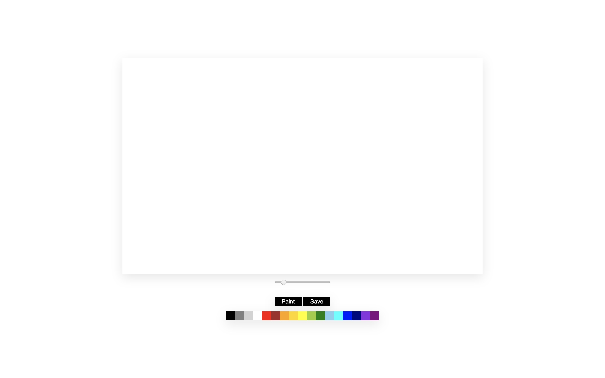

# application7
painting board on vanilla js

## features
- [x] paint
- [x] change brush size
- [x] change color
- [x] fill canvas
- [x] save image

## demo
[https://saintsungminpark.github.io/application7](https://saintsungminpark.github.io/application7)

